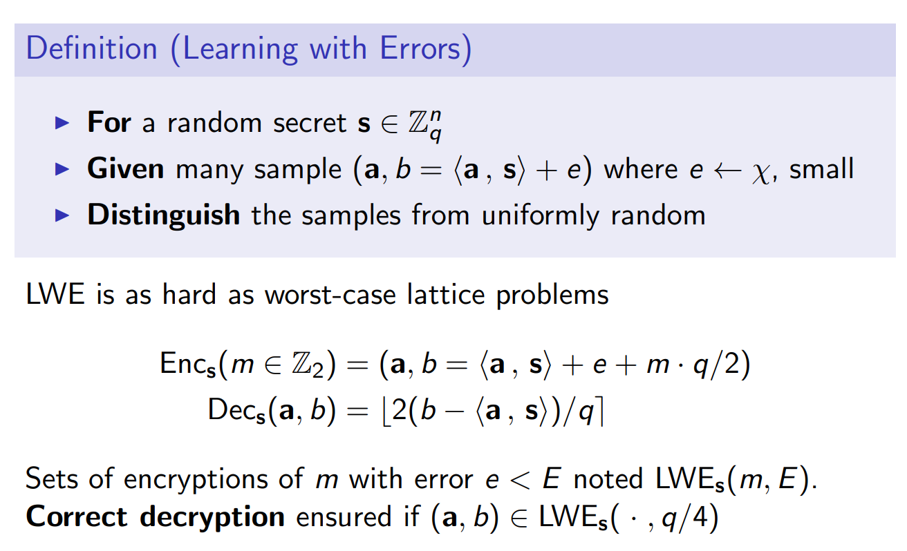

<!--
 * @Description: As vividly shown in the code, 
 * @Version: 2.0
 * @Author: pen9u1nee
 * @Date: 2023-08-24 16:21:57
 * @LastEditors: pen9u1nee
 * @LastEditTime: 2023-09-07 15:23:18
-->

# FHEW 笔记

> 本文主要介绍FHEW的想法以及相关步骤，但是不会涉及到误差界的分析。

## FHEW方案构造

首先，我们回顾一下LWE问题的定义：

给定一个随机的秘密$s \in \mathbb Z_q^n$，给定许多的（比如$m$个）样本：$(a, b = <a, s> + e)$，其中$e$是随机的小的数。目标是将sample从均匀随机中区分出来。

LWE和最坏情形下的格问题一样困难。

基于上述的困难问题，我们设计加密方案。给定$m \in \{0, 1\}$，于是：
* $\operatorname{Enc}_s(m) = (a, b = <a, s> + e + m ·q/2)$
* $\operatorname{Dec}_s(a, b) = \lfloor 2(b - <a, s>)/ q\rceil$，就是计算$b-<a,s>$之后看看结果是靠近0还是$q/2$。

定义：
* 模数$Q$，
* 环维度N = $2^K$，其中$q$整除$2N$，
* 进制$B_g$。比如$B_g = 2$就是二进制。
* 

假设$Q = B_g^{d_g}$，其中$d_g$是整数，$B_g$是3的幂。

消息$m \in \mathbb Z_q$编码成单位原根$Y^m \in \mathcal R$。